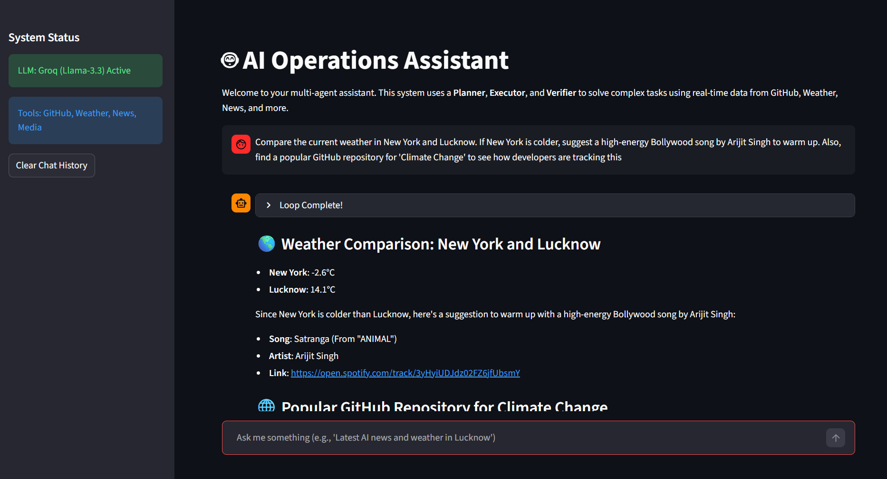
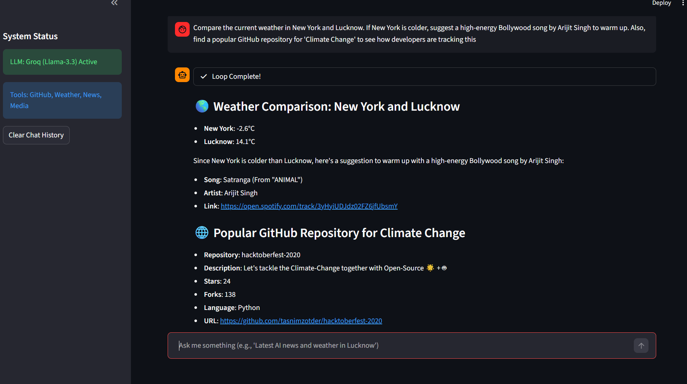

# 🤖 AI Operations Assistant  
### GenAI Multi-Agent System (Planner • Executor • Verifier)

<p align="center">
  
</p>

<p align="center">
  
</p>

---

## 🌟 Overview

The **AI Operations Assistant** is an intelligent **agentic GenAI system** capable of handling **complex natural-language tasks** by planning, executing, and verifying actions using real-world APIs.

Unlike monolithic prompt-based systems, this project demonstrates **true AI agent orchestration** using a **Planner → Executor → Verifier** architecture to ensure:

- ✅ Structured reasoning  
- ✅ Real API-backed responses  
- ✅ Self-correction & retries  
- ✅ Reduced hallucinations  
- ✅ Production-style robustness  

This project was built as a **real-world GenAI engineering demo**, not just an LLM wrapper.

---

## 🚀 Key Features

- 🧠 **Planner Agent** – Converts user intent into a structured JSON execution plan  
- 🛠️ **Executor Agent** – Calls real external APIs based on the plan  
- 🧪 **Verifier Agent** – Validates data, retries failures, formats final output  
- 🔌 **Multi-API Integration** – Weather, News, GitHub, Movies, Music  
- ⚡ **Ultra-Fast LLMs** – Powered by **Groq (Llama-3.x)**  
- 🖥️ **Streamlit UI** – Interactive local interface  
- 🧩 **Modular Architecture** – Clean agent & tool separation  

---

## 🏗️ System Architecture

```

User Query
↓
Planner Agent (LLM)
↓  JSON Execution Plan
Executor Agent
↓  API Responses
Verifier Agent
↓
Final Verified Markdown Answer

````

### 🧠 Planner Agent — *The Brain*
- Understands user intent
- Generates a **step-by-step JSON plan**
- Selects the appropriate tools
- LLM: **Llama-3.3-70B (Groq)**

### 🛠️ Executor Agent — *The Hands*
- Executes each step from the plan
- Calls third-party APIs
- Collects raw structured responses

### 🧪 Verifier Agent — *The Judge*
- Validates completeness & relevance
- Retries when data is missing or incorrect
- Produces a clean, professional Markdown response

---

## 🔌 Integrated APIs & Tools

| Tool | Source | Purpose |
|----|----|----|
| **LLM Engine** | Groq (Llama-3.3 / 3.1) | Planning, reasoning, verification |
| **Weather API** | Open-Meteo | Real-time weather & geocoding |
| **News API** | Currents API | Latest global news |
| **GitHub API** | PyGithub | Repo search, stars, descriptions |
| **Movies API** | TMDB | Movie details, ratings, cast |
| **Music API** | Spotify | Artist & trending song search |

---

## 🧪 Example Prompts

Try these to see the multi-agent system in action:

1. **Multi-Tool Query**  
   *“Tell me the current weather in Lucknow and show the latest news about OpenAI.”*

2. **Developer Search**  
   *“Find a popular FastAPI GitHub repository and show its star count.”*

3. **Entertainment Recommendation**  
   *“Suggest 5 trending songs by Arijit Singh.”*

4. **Logical Comparison**  
   *“Which city is hotter right now, Mumbai or Delhi? Also list the top cast of Inception.”*

5. **Complex Intent**  
   *“Search news about GenAI and find a Python GitHub repo for LLM orchestration.”*

---

## 🛠️ Setup Instructions

### 1️⃣ Prerequisites
- Python **3.9+**
- Virtual environment recommended

---

### 2️⃣ Installation

```bash
# Clone the repository
git clone <your-repo-link>
cd ai_ops_assistant

# Create virtual environment
python -m venv venv

# Activate venv
# Windows
.\venv\Scripts\activate
# macOS / Linux
source venv/bin/activate

# Install dependencies
pip install -r requirements.txt
````

---

### 3️⃣ Environment Configuration

Create a `.env` file in the root directory:

```bash
cp .env.example .env
```

Add your API keys:

```env
GROQ_API_KEY=your_key_here
CURRENTS_API_KEY=your_key_here
SPOTIFY_API_KEY=your_key_here
TMDB_API_KEY=your_key_here
GITHUB_TOKEN=your_key_here
```

---

### 4️⃣ Run the Application

```bash
streamlit run main.py
```

The app will start locally and open in your browser 🚀

---

## ⚠️ Known Limitations & Tradeoffs

* ⏳ **Rate Limits** – Free-tier APIs may return `429 Too Many Requests`
* 🧠 **Context Window** – Verifier processes top 5 results for speed
* 🧪 **Demo-Oriented** – Optimized for clarity over scale

---

## 🔮 Future Improvements

* API response caching
* Parallel tool execution
* Cost tracking per request
* Long-term agent memory
* Dockerized deployment
* Authenticated multi-user sessions

---

## 📌 Why This Project Matters

This project demonstrates **real GenAI engineering skills**:

* Agent-based reasoning (not monolithic prompts)
* Structured planning with JSON schemas
* Real-world API orchestration
* Self-correcting validation loops
* Clean, modular architecture

Perfect for **GenAI Engineer / LLM Engineer / AI Platform / Intern roles**.

---

✨ Built with curiosity, speed, and a love for clean agentic systems.

```
